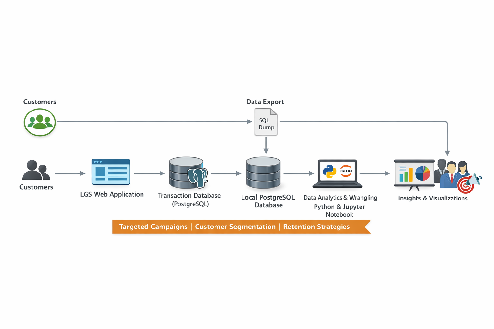

# Introduction
London Gift Shop (LGS) is a UK-based online retailer seeking to understand customer purchasing behaviors and optimize marketing campaigns. The goal of this project is to analyze historical transaction data to generate actionable insights that help LGS increase revenue through data-driven decisions. 

The project involves analyzing customer transactions to identify patterns in order frequency, spending behavior, and canceled orders. These insights enable LGS to design targeted campaigns, personalized promotions, and customer retention strategies.

This analysis was implemented in Python using Pandas, NumPy, and Matplotlib/Seaborn for data manipulation, analysis, and visualization. Data was stored in a local PostgreSQL database and explored through a Jupyter Notebook environment to ensure reproducibility and clarity.

# Implementation

## Project Architecture

The architecture of this project is designed to support retail data analytics and customer insights generation for LGS. It captures the flow of data from customers placing orders to actionable insights used by the marketing team.

1. **Customers**: Place orders through the LGS web application.  
2. **LGS Web Application**: Records all transactions in the production database.  
3. **Transaction Database (PostgreSQL)**: Stores invoices, product details, quantities, prices, customer IDs, and countries.  
4. **SQL Dump / Data Export**: Historical transaction data is exported for analysis without affecting the production system.  
5. **Local PostgreSQL Instance**: Loads the SQL dump so analysis can be performed safely in a local environment.  
6. **Python / Jupyter Notebook Analytics**: Performs data wrangling, cleaning, computations (line-item revenue, invoice totals), and RFM segmentation.  
7. **Insights & Visualizations**: Generates histograms, boxplots, monthly trends, and customer segmentation charts.  
8. **Marketing Team**: Uses insights to design targeted campaigns, optimize promotions, and prevent churn.  

The following diagram illustrates this data flow:

## Data Analytics and Wrangling

The analysis performed includes:

- **Data Cleaning**
  - Handled canceled invoices (marked by invoice numbers starting with 'C').
  - Removed invalid quantities and unit prices.
  - Managed missing or invalid customer IDs.
  
- **Derived Metrics**
  - Calculated line-item revenue per order.
  - Computed total invoice amounts per customer.
  
- **Aggregations**
  - Summed invoices per month.
  - Counted unique customers monthly (monthly active users).
  - Identified placed orders by removing canceled invoices.

- **Customer Insights**
  - RFM (Recency, Frequency, Monetary) analysis was applied to segment customers based on purchase behavior.
  - Identified high-value, loyal, and at-risk customers to optimize marketing strategies.

**Business Impact:**  

The analytics results can help LGS to increase revenue by:

1. **Customer Segmentation**: Targeting high-value customers for loyalty programs and exclusive promotions.  
2. **Churn Prevention**: Detecting inactive or low-recency customers and engaging them with campaigns.  
3. **Targeted Marketing**: Personalized email campaigns and promotions based on purchase frequency and spending patterns.  
4. **Wholesale Optimization**: Understanding bulk buyers’ behavior to optimize pricing and incentives.  

# Improvements
If given more time, the project could be enhanced by:

1. **Automated ETL Pipeline**: Automatically ingest and process new transaction data on a regular schedule.  
2. **Interactive Dashboards**: Use Tableau, Power BI, or web dashboards for stakeholders to explore insights interactively.  
3. **Predictive Analytics**: Extend RFM analysis to include churn prediction or customer lifetime value forecasting using machine learning.
